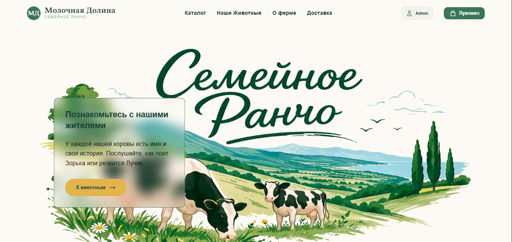

# 🐄 Rancho — E-commerce for a Dairy Farm

Pet project of an online store for a small dairy farm: products tied to specific cows, delivery zones with PostGIS, and a multi-role admin panel.
Built with Laravel 13 + Vue 3 + Inertia.js.

---

## 📸 Demo

> Скриншоты и GIF добавим после записи. Пока — раздел-заглушка.

<!--


| Home | Shop | Product |
|------|------|---------|
|  |  |  |
-->

> No live demo yet — the project runs locally in a few minutes (see [Installation](#-installation)).

---

## 🛠 Tech Stack

**Backend**

- PHP 8.3, Laravel 13
- PostgreSQL + **PostGIS** (delivery zones)
- Laravel Sanctum (API auth for mobile client)
- Laravel Socialite (VK / Google login)
- Spatie Laravel Media Library
- HTMLPurifier (sanitizing rich-text content)
- Tightenco Ziggy (routes in JS)

**Architecture**

- Controllers · Services · **Actions · DTO · Enums · Exceptions · Helpers**
- Observers · Policies · Providers · **API Resources**
- Multi-role: `admin`, `moderator`, `worker`, `customer`
- Soft deletes for cows, products, reviews, pages

**Frontend**

- Vue 3 (Composition API) + TypeScript
- Inertia.js 2
- Vite 8
- Tailwind CSS + Typography plugin
- **Pinia** + persisted state (cart and settings in localStorage)
- **TipTap** — rich-text editor for admin content
- **ApexCharts** (`vue3-apexcharts`) — admin analytics
- **Mapbox GL + Turf.js** — delivery zone map and geo calculations
- **v-calendar** + date-fns — date pickers
- Swiper · Howler · VueUse · vuedraggable
- Headless UI · Heroicons · Lucide · Popper
- browser-image-compression — client-side image compression
- Lodash, lodash.debounce

**Quality**

- PHPUnit 12 (Unit + Feature)
- Laravel Pint (PSR-12)
- Laravel Pail (dev logs)
- Vitest + @vue/test-utils + jsdom
- ESLint 9 (Vue + TS) + Prettier (Tailwind & import-sort)
- barryvdh/laravel-ide-helper

---

## ✨ Features

A condensed list — full breakdown in [docs/FEATURES.md](docs/FEATURES.md).

**Storefront**

- Landing with configurable blocks (hero, banners, FAQ, featured products)
- Product catalog with filters and pagination
- Product pages tied to a specific cow (or generic, cow-less)
- Cows section — each cow has a profile, bio, audio, gallery, genealogy
- Cart stored in Pinia (localStorage), prices re-synced from the server
- Checkout with promo codes and discounts
- Reviews (planned: social login via VK / Google)
- Static pages managed from the DB (About, Contacts, Terms, 404)
- Contact page with a Mapbox map

**Delivery**

- Delivery zones stored as PostGIS polygons
- Outside a zone → no delivery; near a zone → surcharge
- Address picking with Mapbox + Turf.js distance checks

**Admin panel**

- Products, cows, categories, orders, reviews, pages, settings
- Multi-role access: `admin`, `moderator`, `worker`
- TipTap rich-text editor for content
- ApexCharts dashboard
- Image galleries with drag & drop upload (Spatie Media Library)

**Integrations**

- Laravel Socialite (VK / Google) — in progress
- API for an Android client (Sanctum) — partially implemented

**SEO**

- Meta tags per controller (Open Graph + Twitter)
- Full ARIA coverage (roles, `aria-label`, `aria-live`, `aria-busy`, …)
- Sitemap, robots.txt, canonical URLs — planned

---

## 🚀 Installation

### Requirements

- PHP 8.3+, Composer 2
- Node.js 20+, npm
- PostgreSQL 16+ **with PostGIS extension**
- (Optional) Mapbox access token — for the delivery-zone map
- (Optional) VK / Google OAuth credentials
- (Optional) Mailtrap or `MAIL_MAILER=log` for local email

### Steps

```bash
# 1. Clone
git clone https://github.com/your-username/farm-shop.git
cd farm-shop

# 2. One-command setup
# Installs PHP + JS deps, copies .env, generates key, migrates, builds assets
composer setup

# 3. Edit .env:
#   DB_CONNECTION=pgsql
#   DB_HOST=127.0.0.1
#   DB_PORT=5432
#   DB_DATABASE=farm_shop
#   DB_USERNAME=postgres
#   DB_PASSWORD=your_password
#
#   MAPBOX_TOKEN=              (delivery zones)
#   VK_CLIENT_ID= / VK_CLIENT_SECRET=
#   GOOGLE_CLIENT_ID= / GOOGLE_CLIENT_SECRET=
#   MAIL_* (Mailtrap, or MAIL_MAILER=log)

# 4. Enable PostGIS in the database
psql -U postgres -d farm_shop -c "CREATE EXTENSION IF NOT EXISTS postgis;"

# 5. Migrate and seed
php artisan migrate --seed

# 6. Run everything with one command
composer dev
```

`composer dev` starts: `php artisan serve` + `queue:listen` + `pail` (logs) + `vite` — all in one terminal.

App: http://localhost:8000
Admin: http://localhost:8000/admin

### Demo credentials

Created by seeders:

- **Admin:** `admin@example.com` / `password`
- **Moderator:** `moderator@example.com` / `password`
- **Worker:** `worker@example.com` / `password`
- **Customer:** `user@example.com` / `password`

### Optional: Postgres + PostGIS via Docker

```yaml
services:
    db:
        image: postgis/postgis:16-3.4-alpine
        restart: unless-stopped
        ports:
            - '5432:5432'
        environment:
            POSTGRES_DB: farm_shop
            POSTGRES_USER: postgres
            POSTGRES_PASSWORD: secret
        volumes:
            - pgdata:/var/lib/postgresql/data

volumes:
    pgdata:
```

```bash
docker compose up -d db
# then in .env: DB_HOST=127.0.0.1, DB_PORT=5432, DB_PASSWORD=secret
```

---

## 🧪 Tests

```bash
composer test      # PHPUnit (Unit + Feature)
npm test           # Vitest
```

---

## 🗺 Roadmap

Short-term:

- [ ] "Payment on delivery" (cash to courier)
- [ ] Social login via VK / Google
- [ ] Email verification
- [ ] SSR + sitemap + robots.txt + canonical URLs
- [ ] Full delivery-zone map in admin orders
- [ ] GitHub Actions CI (tests + Pint)

Full list → [docs/ROADMAP.md](docs/ROADMAP.md)

---

## 📄 License

MIT

---

## 👤 Author

**Aleksey** — Fullstack Developer
Laravel · Vue.js · TypeScript · PostgreSQL
